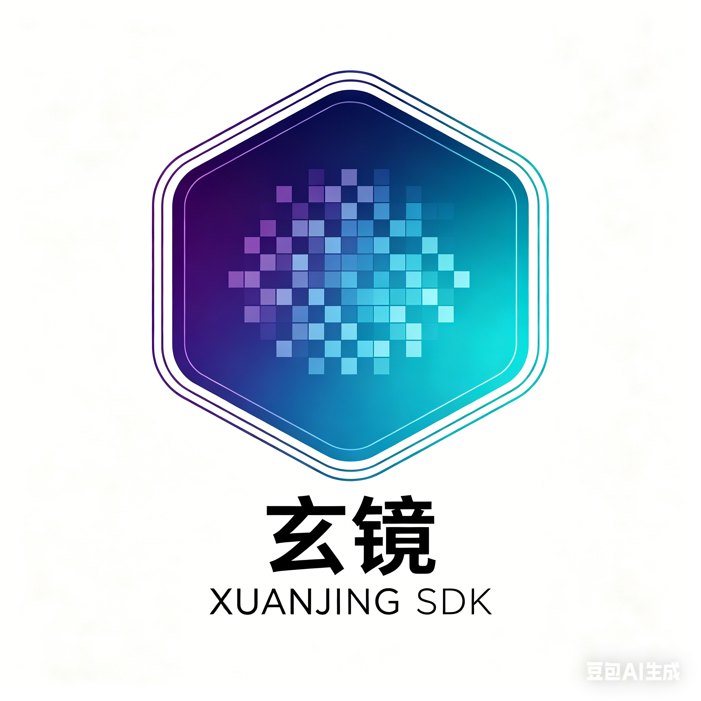

<div align="center">
  

  <h1>玄镜 · Xuanjing SDK</h1>

  <p>
    跨平台 · 开放 · 可研究的 GPU 超分辨率与帧生成 SDK<br/>
    <em>Cross-platform · Open · Research-grade Super Resolution & Frame Generation</em>
  </p>

  <p>
    
    
    
    
  </p>
</div>

---

## 初衷 · Why This Exists

当下，GPU 超分辨率与帧生成技术已成为现代游戏渲染的核心基础设施。
NVIDIA DLSS、AMD FSR、Intel XeSS 各自封闭演进，国产 GPU/NPU 生态缺乏一个**可研究、可扩展、跨厂商**的对应方案。

**玄镜**的起点很简单：

> *我们想搞清楚这件事究竟怎么做，并把过程完整地留下来。*

这不只是一个技术项目，也是一次方法论实验——
用 **工程严谨性** 驱动算法研究，用 **可复现的指标** 代替定性结论，
最终形成一个像 LLVM 一样横跨图形、GPU、编译器、算法的开放技术社区。

---

## 原景 · Vision

```
Phase 1 — 可见性 (M1)
  端到端管线跑通：低分辨率输入 → 时序对齐 → 超分辨率重建 → 显示输出
  量化基线：PSNR / SSIM / LPIPS / 帧时延全链路可测

Phase 2 — 帧生成 (M2)
  置信度门控的插值帧合成
  国产 GPU (Vulkan / SPIR-V 路径) 首次端到端验证

Phase 3 — 编译器加速 (M3)
  xuanjing-compiler: ComputeGraph IR → SPIR-V codegen
  算子融合 · JIT 缓存 · 跨 vendor 后端抽象

Long-term — 开放社区
  研究论文驱动的 RFC 流程
  可复现基准 · 开放贡献 · 多学科协作
  (渲染 · 编译器 · kernel 优化 · 机器学习 联合演进)
```

---

## 技术定位

| 维度 | 定位 |
|---|---|
| **对标参考** | DLSS 3 / FSR 3 的开放研究对应物 |
| **主 IR 格式** | SPIR-V（主路），DXIL（规划），CPU Ref（始终可用） |
| **硬件覆盖** | Vulkan GPU（NV · AMD · 国产）、D3D12（规划）、CPU fallback |
| **质量衡量** | PSNR / SSIM / LPIPS + 帧时延 + flicker rate，全部 CI 自动化 |
| **研究路径** | 每项主要优化须附可复现实验记录（见 `docs/research/`） |

---

## 模块概览

```
xuanjing-runtime    — 编排层，引擎唯一入口，生命周期管理
xuanjing-platform   — 设备能力探测，CapabilityProfile，driver interop
xuanjing-temporal   — 运动向量验证，历史重投影，遮挡检测
xuanjing-upscale    — 超分辨率重建，质量预设路由
xuanjing-genframe   — 帧生成与合成，置信度门控，自动 fallback
xuanjing-shader     — shader pipeline，色彩空间，UI 合成
xuanjing-compiler   — ComputeGraph IR，Pass Manager，SPIR-V codegen
xuanjing-tensor     — 后端选择，JIT 缓存，kernel dispatch
xuanjing-eval       — PSNR/SSIM/LPIPS，帧时延，CI 质量报告
xuanjing-train      — 数据集注册，训练循环，模型包导出
```

完整架构与数据流见 [docs/architecture/sdk_architecture.md](docs/architecture/sdk_architecture.md)。

---

## 算法对比基准 · Algorithm Benchmark

以下结果由 `xuanjing-benchmark-runner` 在静态合成序列（32×18 → 64×36，8 帧）上自动生成。
随算法演进，该表通过 CI 持续更新。

| 算法 | 均值 PSNR (dB) ↑ | 均值 CPU 帧时 (ms) ↓ | 说明 |
|---|---|---|---|
| `passthrough` | — | < 0.01 | 恒等透传，不执行缩放（基线下界） |
| `bilinear` | **33.87** | 0.03 | CPU 双线性插值，作为质量基线 |
| `xuanjing-v0` | _进行中_ | — | 我们的算法，敬请期待 |
| `fsr1` | _规划中_ | — | AMD FSR 1.0 参考对比 |

> 完整 JSON 报告见 `build/release/samples/benchmark_comparison.json`，
> 使用 `samples/benchmark_runner/benchmark_runner.cpp` 可在本地复现。
>
> **如何添加新算法：** 实现 `xuanjing::upscale::IUpscaler` 接口，
> 在 `benchmark_runner.cpp` 中注册，重新构建即可自动纳入对比。

---

## 快速开始

**依赖**：CMake ≥ 3.20，Ninja，C++17 编译器，clang-format

```bash
# 配置（开发模式，含 AddressSanitizer）
cmake --preset dev

# 构建
cmake --build build/dev -j$(nproc)

# 运行测试
ctest --test-dir build/dev --output-on-failure
```

其他预设：

| 预设 | 用途 |
|---|---|
| `dev` | 开发，含调试符号 |
| `release` | 发布，O3 优化 |
| `asan` | AddressSanitizer |
| `coverage` | 覆盖率采集 |

---

## 代码规范与 CI

```bash
bash tools/lint.sh      # clang-format 检查
bash tools/coverage.sh  # 覆盖率报告
```

CI 在每次 push 自动运行：构建矩阵 × CodeQL 安全扫描 × 覆盖率 × Changelog 检查。
详见 [docs/CI_CD_SETUP.md](docs/CI_CD_SETUP.md)。

---

## 文档索引

| 文档 | 内容 |
|---|---|
| [docs/architecture/sdk_architecture.md](docs/architecture/sdk_architecture.md) | 模块架构、数据流、IR 设计、ADR |
| [docs/ALGORITHM_CONTRIBUTION_GUIDE.md](docs/ALGORITHM_CONTRIBUTION_GUIDE.md) | **新算法接入指南**，各 hook 接入点、注册方式、验收门控 |
| [docs/specs/module_goals_acceptance.md](docs/specs/module_goals_acceptance.md) | 各模块目标、验收标准、依赖拓扑、开发排期 |
| [docs/specs/io_spec.md](docs/specs/io_spec.md) | 引擎侧输入/输出合约，UI 合成约束 |
| [docs/MILESTONES_M1_M2_M3.md](docs/MILESTONES_M1_M2_M3.md) | 里程碑计划 |
| [docs/CODING_STANDARDS.md](docs/CODING_STANDARDS.md) | 编码规范 |
| [docs/research/RESEARCH_AGENDA.md](docs/research/RESEARCH_AGENDA.md) | 研究议题与实验协议 |
| [CHANGELOG.md](CHANGELOG.md) | 变更记录 |

---

## 参与贡献

项目当前处于早期阶段，架构设计和 API 合约仍在演进。
欢迎通过 Issue 提出讨论，或参考 [docs/CODING_STANDARDS.md](docs/CODING_STANDARDS.md) 提交 PR。

重大跨模块变更请先提 RFC（模板见 `docs/` 目录）。

---

<div align="center">
  <sub>玄镜 · 以技术透明推动图形渲染的下一个十年</sub>
</div>
